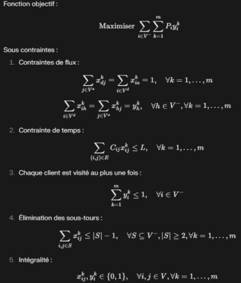

# Problème d'Orientation en Équipe (Team Orienteering Problem - TOP)

## Introduction

Le **TOP** est une variante du problème de tournées de véhicules, visant à maximiser le profit total collecté tout en respectant des contraintes de temps. Ce problème combine la planification de routes et la sélection de clients, avec des applications dans :

- **Logistique et distribution** : optimisation des livraisons pour les clients les plus rentables.
- **Tourisme** : planification d’itinéraires maximisant la satisfaction des visiteurs dans un temps limité.
- **Maintenance** : priorisation des clients critiques.
- **Véhicules autonomes** : sélection optimale des points à visiter avec une autonomie limitée.

---

## Définition Formelle

### Modélisation Mathématique

Le TOP est représenté par un graphe complet \( G = (V, E) \), où :

- \( V = \{1, ..., n\} \cup \{d, a\} \) : ensemble des nœuds (clients et dépôts).
- \( E = \{(i, j) \mid i, j \in V\} \) : ensemble des arcs reliant les nœuds.

#### Composants :

- **Clients** : \( i \in V^- \) avec un profit associé \( P_i \).
- **Dépôts** : \( d \) (départ) et \( a \) (arrivée).
- **Profits** : \( P_i \) pour chaque client \( i \).
- **Contraintes de temps** : \( C\_{ij} \) : temps entre \( i \) et \( j \), \( L \) : limite pour chaque véhicule.
- **Flotte** : \( m \) véhicules identiques disponibles.

## 

## Formulation Mathématique

### Variables de Décision

- \( x\_{ijk} \) : 1 si le véhicule \( k \) voyage du nœud \( i \) au nœud \( j \), 0 sinon.
- \( y\_{ik} \) : 1 si le client \( i \) est visité par le véhicule \( k \), 0 sinon.

### Objectif

Maximiser le profit total collecté.

### Contraintes

1. **Flux** : continuité des routes.
2. **Temps** : limite de durée pour chaque tournée.
3. **Visite unique** : chaque client est visité au maximum une fois.
4. **Élimination des sous-tournées** : routes valides.
5. **Intégrité** : variables binaires.

---

## Implémentation de l'Algorithme

L'algorithme implémenté pour résoudre le **TOP** combine plusieurs approches heuristiques et métaheuristiques :

### Heuristique Constructive

Une heuristique constructive basée sur une adaptation de la méthode de Clarke et Wright est utilisée pour générer une solution initiale. Cette méthode construit itérativement les routes en sélectionnant à chaque étape le client non visité qui offre le meilleur rapport **profit/temps**, tout en respectant les contraintes de temps.

### Recherche Locale

Une phase de recherche locale est appliquée pour améliorer la solution initiale. Elle utilise plusieurs opérateurs :

- **2-opt** : échange deux arêtes non adjacentes dans une route.
- **Or-opt** : déplace une séquence de 1 à 3 clients consécutifs à une nouvelle position dans la route.
- **String Cross** : échange des segments de route entre deux véhicules.
- **String Exchange** : échange des clients individuels entre deux routes.
- **String Relocation** : déplace un client d'une route à une autre.

### Méthode de Beasley Adaptée

Cette méthode crée d'abord un **tour géant** visitant tous les clients, puis le divise en segments réalisables pour former les routes individuelles des véhicules. L'approche comprend deux étapes principales :

1. **Création du tour géant** : utilise une heuristique gloutonne basée sur le ratio profit/distance.
2. **Division du tour** : emploie la programmation dynamique pour trouver la division optimale qui maximise le profit total tout en respectant les contraintes de temps et de nombre de véhicules.

### Sélection de la Meilleure Solution

L'algorithme compare les solutions obtenues par :

- L'heuristique constructive.
- La recherche locale.
- La méthode de Beasley adaptée.

Il sélectionne ensuite la meilleure en termes de **profit total**.

### Gestion des Contraintes

Toutes les étapes de l'algorithme prennent en compte les contraintes spécifiques du **TOP**, notamment :

- Le temps limite de parcours pour chaque véhicule.
- L'unicité de la visite pour chaque client.

### Justification des Choix

- **Hybride** : La combinaison des heuristiques locales et globales permet de capturer les nuances de chaque solution, équilibrant rapidité et qualité.
- **Recherche Locale** : Les techniques d'amélioration locale garantissent un raffinement constant des solutions.
- **Adaptation de Beasley** : Une vue d'ensemble globale offre des solutions viables même pour des instances complexes.

---

## Expérimentations et Résultats

- **Instances de Test** : Chao et al. (1996).
- **Paramètres** :
<!--
  - Itérations maximales : 1000.
  - Critère d’arrêt : amélioration < 0.1% sur 100 itérations consécutives.
  - Taux de refroidissement (si recuit simulé utilisé) : 0.99.
- **Résultats** :
  - Écart moyen < 5% (petites/moyennes instances).
  - Écart moyen ~8% (grandes instances). -->

---

## Références Bibliographiques

1. Chao, I-M., Golden, B.L., Wasil, E.A. (1996). _The team orienteering problem_. European Journal of Operational Research, 88(3), 464-474.
2. Vansteenwegen, P., Souffriau, W., Van Oudheusden, D. (2011). _The orienteering problem: A survey_. European Journal of Operational Research, 209(1), 1-10.
3. Gunawan, A., Lau, H.C., Vansteenwegen, P. (2016). _Orienteering Problem: A survey of recent variants, solution approaches and applications_. European Journal of Operational Research, 255(2), 315-332.
